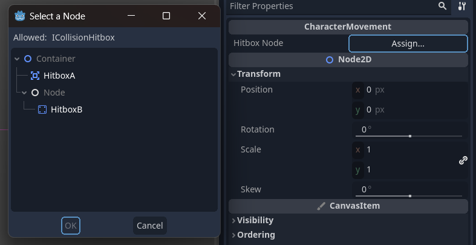

# Godot Interface Export

Godot C# package to support exporting interface types!

## Installation

1. Install the C# package from nuget.

```sh
dotnet add package Godot.DependencyInjection
```

2. Add `interface_export` to your addon folder.
3. Activate the plugin from the project settings.

## Usage

To start using interface exports, add the `[ExportInterface]` attribute to an exported property. Make sure that:

1. The exported value is a property. It cannot be a field.
2. The property is also annotated with `[Export]`.
3. The property name ends with "Node". (Similar to how signals need to end with "EventHandler")

```cs
public partial class CharacterMovement : Node2D
{
    [Export]
    [ExportInterface(typeof(ICollisionHitbox))]
    private Node? _hitboxNode { set; get; }
}
```

Now, `ICollisionHitbox _hitbox` will be generated for you, and you can use it in your codebase as you please.

```cs
public override void _Ready()
{
    _hitbox.CollisionHitboxMethod();
}
```

Furthermore, when selected the node in the Godot editor, the node picker will now type-check the node for you:



### Manual Fields

If you don't want to mess with source generators or just prefer your code to be more explicit, you can turn off the property generation:

```cs
public partial class CharacterMovement : Node2D
{
    [Export]
    [ExportInterface(typeof(ICollisionHitbox), false)]
    private Node? _hitbox { set; get; }
    public ICollisionHitbox? Hitbox => _hitbox as ICollisionHitbox;
}
```

This also gives you the freedom the name the exported property anything you want.
